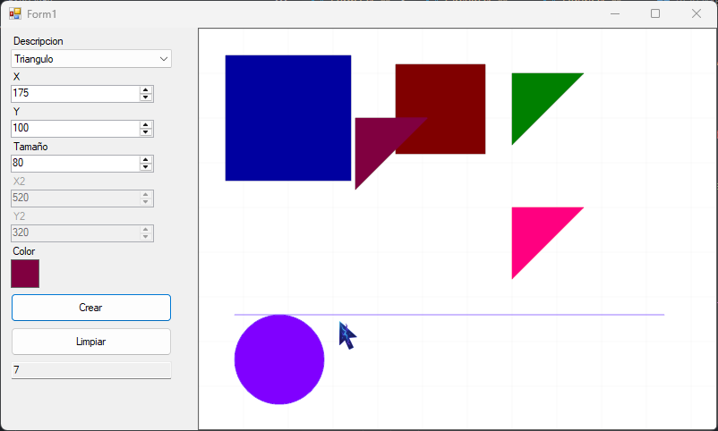

# LienzoFiguras

Aplicación Windows Forms simple para crear y dibujar figuras geométricas en un lienzo. Implementa patrones y validaciones de negocio.

Características
- Patrón Factory: creación de figuras mediante FiguraFactory.
- Herencia y polimorfismo: Figura es la clase base; Rectangulo, Circulo, Linea y Triangulo implementan Dibujar(Graphics).
- Dibujo con Graphics: uso de antialiasing y ajustes estéticos para dibujado de alta calidad.
- Validaciones de negocio:
  - Rectangulo/Circulo/Triangulo: tamaño > 0 y figura completamente visible en el lienzo.
  - Linea: ambos puntos deben estar dentro del lienzo.
  - Color: debe seleccionarse antes de crear la figura.
- UI: selección de figura, coordenadas, tamaño, color, contador de figuras, botones Crear y Limpiar.

Archivos clave
- WindowsFormsApp1/Figura.cs — clase abstracta base con propiedades comunes.
- WindowsFormsApp1/Rectangulo.cs, Circulo.cs, Linea.cs, Triangulo.cs — implementaciones concretas.
- WindowsFormsApp1/FiguraFactory.cs — fábrica que instancia figuras por identificador.
- WindowsFormsApp1/Form1.cs — lógica de UI, validaciones y manejo del lienzo.
- WindowsFormsApp1/Form1.Designer.cs — diseño del formulario y controles.

Cómo usar
1. Abrir la solución LienzoFiguras/LienzoFiguras.sln en Visual Studio (requiere .NET Framework 4.8).
2. Ejecutar el proyecto.
3. En la interfaz:
   - Seleccione el tipo de figura (Rectangulo, Circulo, Linea, Triangulo).
   - Ajuste X, Y, Tamaño y (si aplica) X2, Y2.
   - Haga clic en el recuadro de color para elegir color (obligatorio antes de Crear).
   - Pulse Crear para agregar la figura al lienzo.
   - Pulse Limpiar para eliminar todas las figuras y reiniciar el contador.

Notas de implementación
- La fábrica acepta identificadores sin tilde y no distingue mayúsculas/minúsculas.
- El contador (txtContador) se actualiza al crear y limpiar.
- Se usa DoubleBuffered en el PictureBox para reducir flicker; PbLienzo.Refresh() fuerza repintado inmediato.
- Mensajes de validación muestran información clara sobre la regla violada.

Consideraciones futuras
- Extraer validaciones a una clase separada (p. ej. ValidadorFiguras) para limpiar Form1.
- Añadir serialización para guardar/cargar composiciones.
- Implementar deshacer/rehacer (Undo/Redo) y capas.

Prueba de Escritorio

Licencia
Proyecto Académico.

